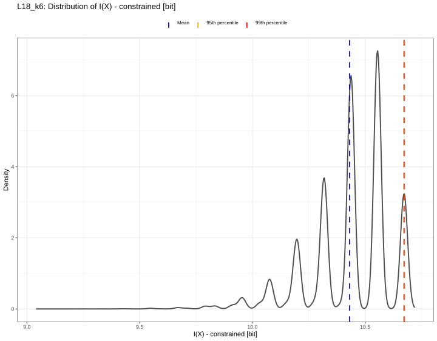

# Information theoretic analysis of randomness and structure in clinical olfactory test design

This repository is the computational companion to the accompanying manuscript:

Lötsch J, Hummel T, Himmelspach A. Information theoretic analysis of randomness and structure in clinical olfactory test design.

The manuscript asks whether the ordered sequence of correct-response positions in a forced-choice test can be quantified and used to compare test formats. Odor-identification tests are the worked examples, including short screening formats and the 40-item UPSIT; the same sequence measures are applicable to other forced-choice formats. The code supports the manuscript's response-key analyses. It does not replace conventional participant scoring or establish that a more informative key improves clinical validity or patient outcomes. The manuscript remains the source for the scientific rationale, full methods, and interpretation.

## Example figure

The figure below shows the constrained reference distribution of the informativeness score $I(X)$ for an 18-trial, 6-alternative design, generated by the theoretical analysis workflow.



## Repository scope

The main response-key workflow is implemented in:

- `R/globals.R` — shared package setup, helper functions, and common plotting utilities
- `R/theoretical_distributions_and_scores.R` — theoretical chance and informativeness distributions for test sequences
- `R/real_id_choices_anaylsis.R` — empirical analysis of patient response patterns and foreseeable rule-based answering strategies

The repository also contains a separate analysis of participant response patterns, described below. Legacy analyses and unrelated Python or historical project files are outside the scope of this README.

## Scientific role of the code

### 1) Theoretical score and reference-distribution analysis

The script `R/theoretical_distributions_and_scores.R` represents a test key as the ordered sequence of correct-answer positions and quantifies its structure using empirical block entropies.

It includes:

- classical chance distributions for forced-choice tests with $L$ trials and $k$ alternatives
- unconstrained and constrained random-sequence reference models
- Monte Carlo generation of unconstrained and equal-frequency constrained reference distributions for the informativeness score $I(X)$
- reference intervals and summary tables used to interpret empirical and theoretical values
- chance distributions for participant total-correct scores, kept distinct from response-key informativeness
- plots and ranked candidate keys for comparing sequence structures across formats

The score is the sum of the first-, second-, and third-order empirical entropies, with unit weights in the default analysis. Equal-frequency constrained sequences are available only when $L$ is divisible by $k$. The manuscript should be consulted for the complete definitions and interpretation.

### Optimization and interpretation limits

The code exhaustively enumerates the full sequence space only when it is small enough (at most one million sequences by default). For larger designs, the reported reference maxima are the best values found in Monte Carlo samples; they are not certificates of a global optimum. The candidate lists are likewise ranked from sampled sequences. Do not interpret a sampled maximum as exact optimization. Any exact-optimization result in the manuscript that is not covered by this small-space enumeration requires a separate implementation or derivation beyond the current workflow.

### Sequence files for independent evaluation

The [Sequences](./Sequences) folder provides up to 300 unique high-scoring candidate sequences for each available test design. They are drawn from the Monte Carlo samples, not from exhaustive enumeration of all possible keys. These files are provided for readers who want to inspect the candidates or independently evaluate possible response keys. They are named
`scores_L< L >_k< k >_top_sequences.txt`, where $L$ is the number of trials and $k$ is the number of response alternatives.

Each file contains the unconstrained sequences first. When a constrained equal-frequency analysis is possible, the constrained sequences follow after a heading such as:

```text
--- Top 300 unique constrained sequences by I score (L=18, k=6) ---
```

The constrained section is the relevant section when selecting a balanced test response key: every response position occurs equally often in these sequences. To use a file, select the file matching the desired $L$ and $k$, then read the sequence entries under the constrained heading. The digits in each sequence identify the response position selected on each trial.

An equal-frequency constraint can be applied only when $L$ is a multiple of $k$; a constrained section is included only for designs for which constrained sequences were retained. If no constrained section is present, the file contains only a heading such as:

```text
--- Top 300 unique unconstrained sequences by I score (L=18, k=6) ---
```

In that case, the listed sequences are still ranked candidates for independent evaluation, but they do not guarantee equal use of all response positions. The unconstrained sequences are also useful as a reference for comparing balanced and unrestricted sequence structures.

The sequence entries encode response positions, not odor identities. They are candidate keys for a chosen format; they do not change the test items or the interpretation of participant scores.

### Interpretation and design implications

The analysis treats the ordered sequence of correct response positions as a design property alongside test length $L$ and number of alternatives $k$. The block-entropy measures $H1$, $H2$, and $H3$ capture marginal balance and local sequence predictability; their weighted combination gives $I(X)$ and its per-trial form. Candidate keys can be compared within a fixed format, while total and per-trial scores support comparisons across formats.

This sequence analysis does not replace conventional clinical scoring. Participant performance remains the number of correctly identified odors, with its usual binomial chance interpretation. Informativeness describes the response key and the extent to which its structure avoids predictable positional patterns that could support non-olfactory response strategies.

For a fixed format, response keys can be evaluated before administration and selected from a predefined catalogue. The established odor items, response format, and interpretation of participant scores remain unchanged. Reporting the implemented sequence or its catalogue identifier makes the administered key reproducible. The workflow also supports retrospective comparison of published test versions and candidate formats on a common information-based scale.

For reproducible reporting, describe the test parameters together with response-position balance, $H1$, $H2$, $H3$, total or per-trial informativeness, the reference used for any relative-efficiency value, and the selected sequence or catalogue identifier. Entropy measures describe key structure; binomial chance probabilities describe total-correct scores; Hamming distance describes similarity to specified response-pattern templates. These are complementary analyses, not interchangeable measures.

### 2) Separate analysis of participant response patterns

The script `R/real_id_choices_anaylsis.R` is a separate analysis of patient response patterns; it is not needed to reproduce the response-key entropy distributions. It converts answer strings into choice positions, summarizes patterns, and compares selected pattern features with random-choice expectations.

It includes:

- encoding answer strings into trial-wise choice positions
- compact summary of repeated pattern structures
- assessment of foreseeable deterministic or rule-based response behavior
- Hamming-distance analysis against a priori pattern templates
- reporting of pattern statistics relative to uniform random choice

This component explores whether observed patient response sequences show structure beyond uniform random responding. The patient-level source dataset is not included in this repository, and the script currently refers to a machine-specific input path. It will not run from a clean clone until an authorized copy of the data is available and that input path is configured. The checked-in derived CSV files do not make the script self-contained.

## How to run

From the repository root in R, run the theoretical response-key workflow with:

```r
source("R/theoretical_distributions_and_scores.R")
```

It runs 100,000 Monte Carlo replicates per design by default and writes tables and plots to the current working directory. To run the separate patient-pattern analysis, first configure its input path as described above, then source it from the repository root:

```r
source("R/real_id_choices_anaylsis.R")
```

Generated files are written to the current working directory.

## Dependencies

The shared setup in `R/globals.R` loads these packages:

- `ggplot2`
- `ggthemes`
- `pbmcapply`
- `patchwork`
- `ComplexHeatmap`
- `cABCanalysis`
- `grid` (included with R)

The patient-pattern script additionally requires `psych`. Install `ComplexHeatmap` from Bioconductor; install the other missing packages using their usual R package source. The shared setup loads the full package list even when running only the theoretical script.

## A priori response-key template families

The empirical analysis in `R/real_id_choices_anaylsis.R` generates a catalogue of sequence families that are evaluated as foreseeable response-key patterns. These are the families used to formalize the idea that a participant may answer by following a positional rule rather than by odor perception. The following examples are representative of the generated catalogue in the code, using the 16-trial, 4-alternative format of the clinical task.

| Family | Example sequence | Interpretation |
| --- | --- | --- |
| Constant | 1111111111111111 | Same response position across all trials |
| Cyclic ascending | 1234123412341234 | Repeating cycle across the response positions |
| Cyclic descending | 4321432143214321 | Reverse repeating cycle |
| Doubled cyclic ascending | 1122334411223344 | Two-trial blocks of each position |
| Block ascending | 1111222233334444 | Large positional blocks |
| Two-alternative alternation | 1212121212121212 | Repeated alternation between two positions |
| Two constant halves | 1111111122222222 | One positional rule for the first half, another for the second |
| Zigzag ascending | 1234321234321234 | Alternating sweep with local reversals |
| Palindromic sweep | 1234432112344321 | Symmetric sweep-like pattern |

These examples illustrate the templates used by the separate patient-pattern analysis. The template comparison is not the same as scoring the test key's informativeness, and the catalogue should not be treated as an exhaustive set of possible response strategies.

## Main outputs

Running the scripts produces reproducible summaries and result files such as:

- `chance_table_*.csv`
- `scores_*.csv`
- `scores_*_summary_I.csv`
- `scores_*_top_sequences.txt`
- `I_reference_distribution_summary_full.csv`
- `I_reference_distribution_summary_compact.csv`
- `foreseeable_pattern_results.csv`

## Reader and reviewer note

This repository is a technical companion to the paper: it makes the response-key calculations and available outputs inspectable. The manuscript remains authoritative for scientific interpretation, discussion, and contextualization. The patient-pattern workflow has the separate data-access limitation noted above.

## Citation

Use this repository as the corresponding computational companion to the paper and the implementation layer used to generate the reported analyses. Please cite the associated manuscript as:

Lötsch J, Hummel T, Himmelspach A. Entropy-based design of response-key sequences in forced-choice olfactory identification tests. (submitted)

